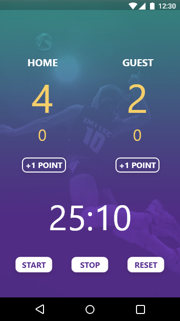

# ABND | Score Keeping App 
This is the second part of the Android Basics Nanodegree program offered by Udacity in collaboration with Google. 

# Project Description
Implement an app to track scores between two teams within a game

# Pre-requisites
-	Android SDK v22
-	Android Build Tools v22.0.1
-	Android Support Repository v22.1.1

# Learning objecives
- Apply OOP techniques in building the app (classes, objects, methods, casting etc.)
- Adding interactivity through set boxes, submitting buttons and reading user input.
- Basic debugging and logging techniques.
- Change view content on the same activity.
